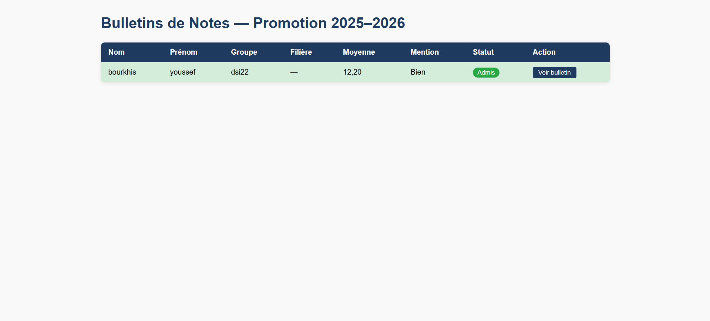
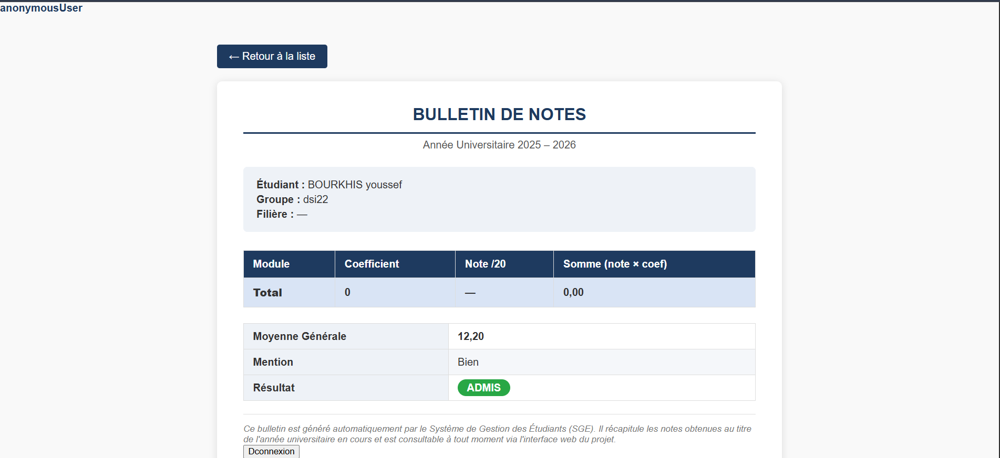
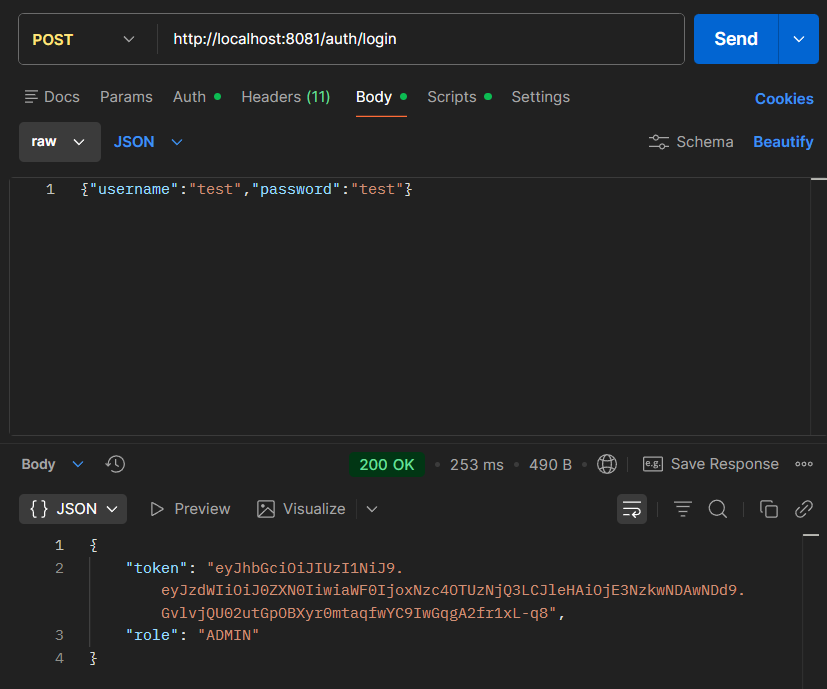
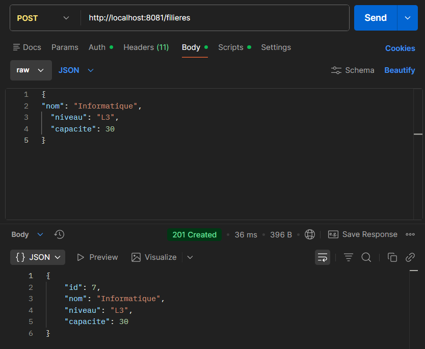

# SGE — Système de Gestion des Étudiants

Application Spring Boot permettant de gérer des étudiants, des filières, des modules, des notes et de générer des bulletins (Thymeleaf).

## Fonctionnalités

- Authentification JWT (`/auth/register`, `/auth/login`)
- Gestion des filières (CRUD) via REST (`/filieres`)
- Gestion des étudiants (CRUD) via REST (`/etudiants`)
- Gestion des modules (CRUD) via REST (`/modules`)
- Gestion des notes (CRUD) via REST (`/notes`)
- Bulletins (pages Thymeleaf)
  - Liste: `GET /bulletins`
  - Détail: `GET /bulletins/{etudiantId}`

## Prérequis

- Java (JDK 17+ recommandé)
- Maven (ou Maven Wrapper fourni avec le projet)
- MySQL (base `sge_db`)

## Configuration base de données (MySQL)

1. Démarrer MySQL.
2. Créer la base:

```sql
CREATE DATABASE IF NOT EXISTS sge_db;
```

3. Vérifier la configuration dans [application.properties](file:///c:/Info/DSI2/spring%20boot/SGE/src/main/resources/application.properties):

- `spring.datasource.url=jdbc:mysql://localhost:3306/sge_db`
- `spring.datasource.username=root`
- `spring.datasource.password=`

Si vous utilisez un autre utilisateur / mot de passe, mettez à jour ces valeurs.

## Lancer l’application

Par défaut l’application écoute sur le port `8083`:

```properties
server.port=8083
```

### Avec Maven Wrapper (Windows)

Si Java n’est pas détecté, définissez `JAVA_HOME` et ajoutez `%JAVA_HOME%\\bin` au `PATH`.

Commande:

```powershell
.\mvnw.cmd spring-boot:run
```

### Build / tests

```powershell
.\mvnw.cmd test
.\mvnw.cmd package
```

## Accès (URLs)

- Accueil (si présent): `http://localhost:8083/`
- Bulletins (liste): `http://localhost:8083/bulletins`
- Bulletin (détail): `http://localhost:8083/bulletins/1` (exemple)

## Utilisation via Postman

### 1) Créer un utilisateur et récupérer un token (JWT)

- `POST http://localhost:8083/auth/register`
- `POST http://localhost:8083/auth/login`

Body JSON:

```json
{ "username": "test", "password": "test" }
```

Le token est retourné dans la réponse. Pour appeler un endpoint protégé, ajoutez l’en-tête:

```
Authorization: Bearer <token>
```

### 2) Ajouter une filière

Endpoint:

- `POST http://localhost:8083/filieres`

Body JSON:

```json
{
  "nom": "Informatique",
  "niveau": "L3",
  "capacite": 30
}
```

### 3) Ajouter un étudiant (exemple)

- `POST http://localhost:8083/etudiants`

Exemple minimal:

```json
{
  "nom": "Doe",
  "prenom": "John",
  "email": "john.doe@example.com",
  "cin": "12345678",
  "groupe": "G1",
  "moyenne": 0
}
```

Ensuite:

- Ouvrir `http://localhost:8083/bulletins`
- Cliquer sur “Voir bulletin” pour afficher la page détail

## Notes sécurité (DEV)

Pour faciliter les tests en navigateur, le projet a été ajusté pour rendre publics:

- `GET /bulletins/**` (pages Thymeleaf)
- `/filieres/**`

Vous pouvez réactiver la protection ensuite dans [SecurityConfig.java](file:///c:/Info/DSI2/spring%20boot/SGE/src/main/java/com/example/sge/config/SecurityConfig.java).

## Captures d’écran

- Liste des bulletins:
  - 
- Détail bulletin:
  - `
- Requêtes Postman (ex: ajout filière / login):
  - 
  - 

